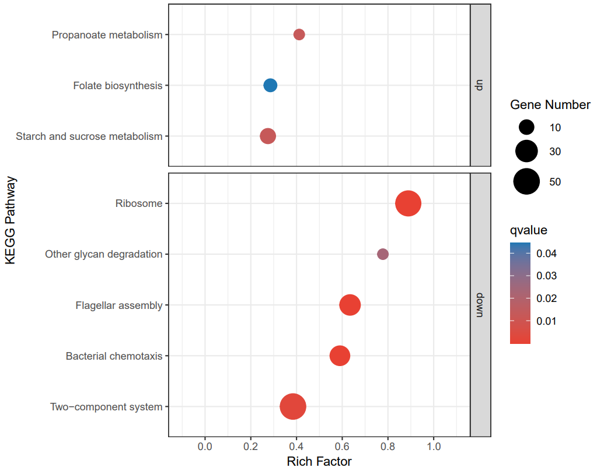

This repo contains some R scripts for visualzing data.

**Table of Contens:**

1. [Bubble plot](./Scripts/bubble_plot.R)
2. Volcano plot
3. Ordination analysis plot

---

**Note:**

- For heatmap, [TBtools](https://github.com/CJ-Chen/TBtools-II/releases) is highly recommended;
- For bar plot with error bar and significant difference, GraphPad Prism is highly recommended.

## Bubble Plot

Bubble plot is often used to illustrate the result of KEGG enrichment analysis. Here, an outcome of KEGG enrichment is used as the example data.

**Final plot:**

